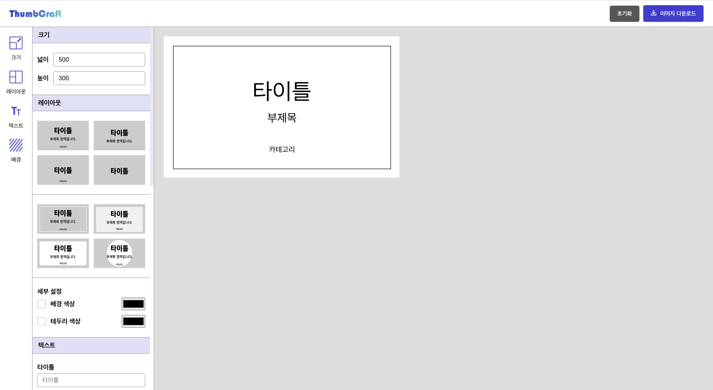
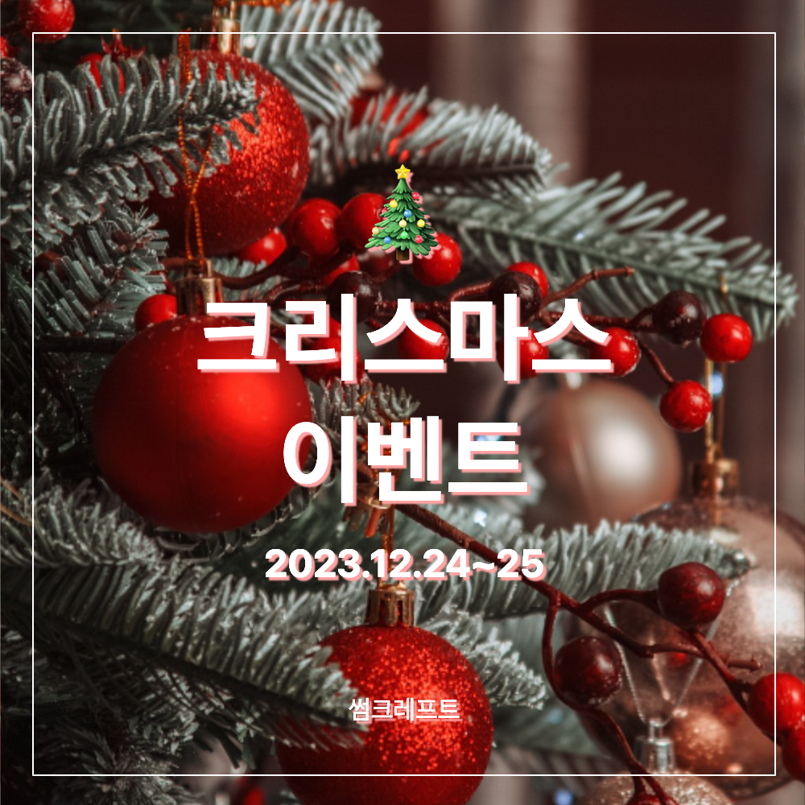

# thumbCraft 🖼
- 썸네일을 만들어주는 웹사이트입니다. 💻️ pc에서만 가능합니다!
- 모바일 버전은 오픈 중입니다. 기다려주세요.
- [🌐 thumbCraft 웹사이트로 바로가기](https://stupendous-caramel-85564d.netlify.app/)
 

 

### 📅 프로젝트 기간 
- 2023.11

 

### ⭐︎ Front-end 기술선정

#### React
- <b>useState 사용</b>
  - Preview 컴포넌트에서 캔버스의 너비와 높이, 텍스트 내용, 스타일 클래스, 그림자 유무, 글자 색상 등을 다양한 상태 값을  useState를 통해 상태로 관리. 
  - 상태 값들은 UI의 변화와 상호작용하며 동적인 컴포넌트 업데이트 함.

- <b>useEffect 사용</b>
  - useEffect를 통해 resetPreview 상태 변경 시 초기화 작업 설정 및 외부 라이브러리(html2canvas)를 활용한 이미지 다운로드 등에 활용. 
  - 초기화 버튼을 누르면  Header 컴포넌트의 handleReset 함수가 호출되면 Preview 컴포넌트 내부의 resetPreview 값이 변경. 
  - 값이 변경되면 Preview 컴포넌트에 있는 useEffect를 발동시켜 상태를 초기화하고 handleResetPreview 함수를 실행.

- <b>useRef 사용</b>
  - BgStyle 컴포넌트에서 파일을 선택하고 업로드하는 동작을 구현하기 위해 DOM 요소에 접근하여 파일 입력을 관리하기 위해서  useRef를 사용.

- <b> User Interaction Events</b>
  - 사용자가 버튼 클릭하면 onClick 이벤트가 발생하며, 클래스 추가, 초기화, 이미지 다운로드 등의 특정 작업을 수행하는 데 사용.
  - 텍스트 입력 필드나 컬러 선택과 같은 요소에서 사용자 입력에 따라 동적으로 상태가 변화하고 UI가 업데이트 되기 위하여 onChange 이벤트를 사용. useState와 상호작용함.

- <b>Props 사용</b>
  - resetPreview, handleResetPreview 등 props를 통해 상위 컴포넌트에서 하위 컴포넌트로 데이터를 전달.

- <b>조건부 렌더링</b>
  - 상태에 따라 특정 UI 요소를 조건부로 렌더링.
  - 체크박스 상태에 따라 그림자 효과를 토글.
  - 선의 유무를 결정.

#### HTML2Canvas
- html2canvas 라이브러리를 사용하여 특정 영역을 이미지로 다운로드하는 기능을 구현

 

### 💻️ 프론트엔드 기술 스택

  
  
  
  
  
  

 

### 🔧 주요 기능
- artboard의 크기, 레이아웃 변경
- 배경 및 텍스트 색상 변경 
- 이미지 업로드 및 다운로드
- artboard 초기화

 

### ⭐︎ thumbCraft로 만든 썸네일 이미지 ⭐︎

  
  

